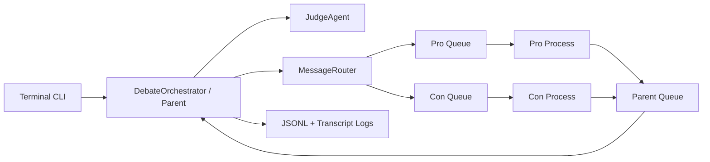

# AI Agent Debate

Exercise 02 project for a multiprocessing AI debate between a parent judge agent, a pro
agent, and a con agent.

## Project Goal

The system runs a respectful debate on the configured topic:

> Should universities require students to use AI agents in software engineering courses?

The default configuration uses 5 turns per side, which equals 10 total pings. This follows
the assignment note that 10 pings are required, with 5 per side accepted when documented.

## Architecture



Key classes:

- `BaseAgent`: shared queue behavior.
- `DebateAgent`: child process for pro/con turns.
- `JudgeAgent`: final scoring and no-tie decision.
- `DebateOrchestrator`: starts processes, routes turns, stops children.
- `Message`: validated JSON IPC schema.
- `DebateMemory` and `PromptBuilder`: context engineering layer.
- `Gatekeeper`: simple call and input-size budget guard.
- `Watchdog`: detects dead or non-responsive child processes.

## IPC Rules

Agents are treated as process-like components. The project uses
`multiprocessing.Process` and `multiprocessing.Queue`. Child agents never communicate
directly. Every message goes through the parent judge/orchestrator:

```json
{
  "round": 1,
  "sender": "pro",
  "receiver": "judge",
  "type": "argument",
  "content": "...",
  "sources": ["..."]
}
```

Direct `pro -> con` or `con -> pro` messages are rejected by validation.

## Context Window Engineering

The project implements the lecture's Select/Write idea.

Write:

- Full messages are saved to JSONL logs and a readable transcript.
- `DebateMemory` keeps complete in-memory messages.
- A compact running summary is updated outside the prompt.

Select:

- Child prompts receive only role, stance, topic, rules, opponent previous argument,
  compact summary, current judge instruction, and search evidence.
- Judge prompts receive topic, rules, latest pro/con arguments, compact summary, scoring
  criteria, and round number.

The full debate history is not blindly sent to every agent on every turn.

## Setup

```powershell
cd C:\Users\Aisha\Desktop\AI\uoh-ay26-ai-agent-debate
uv sync --extra dev
copy .env.example .env
```

Edit `.env` and add one real provider key. Gemini is the recommended free/cloud option:

```env
GEMINI_API_KEY=your_real_google_ai_studio_key
```

OpenAI is also supported:

```env
OPENAI_API_KEY=your_real_openai_key
```

The real `.env` file is ignored by Git.

The config uses `provider: auto`. It selects Gemini when `GEMINI_API_KEY` exists, OpenAI
when only `OPENAI_API_KEY` exists, and mock mode when no real key exists. For real
assignment runs, use a real Gemini or OpenAI key.

If a provider returns a quota, billing, or key error, the default config also enables
`fallback_to_mock_on_provider_error: true`. The transcript will clearly mark mock fallback
turns instead of crashing with a Python traceback.

## Run

Terminal menu:

```powershell
uv run agent-debate
```

Direct module form:

```powershell
uv run python -m agent_debate.cli
```

Menu options:

1. Run debate
2. Show last transcript
3. Save transcript
4. Validate config
5. Exit

## Tests and Lint

```powershell
uv run pytest
uv run ruff check .
```

Plain `pip` fallback:

```powershell
python -m pip install -r requirements-dev.txt
$env:PYTHONPATH="src"
python -m pytest
ruff check .
```

## Prompt Book

The documented prompt templates are in `docs/PROMPT_BOOK.md`.

## Logs

Logs are saved under `logs/`:

- `logs/debate.jsonl`: structured JSON Lines log.
- `logs/transcript.txt`: readable debate transcript.
- `logs/transcript-YYYYMMDD-HHMMSS.txt`: saved transcript exports from menu option 3.

## Web Search

The `WebSearchTool` uses a lightweight DuckDuckGo HTML request with a timeout and returns
source URLs for the agents. If the network is unavailable, it degrades gracefully and the
debate still runs.

## Screenshots

Add screenshots here before submission:

- CLI main menu.
- Config validation output.
- A completed debate transcript.
- Test and Ruff output.

## Limitations

- The mock provider is for tests and API-free dry runs only; the submitted real debate
  should use a real LLM provider.
- Web search is best-effort and depends on network availability.
- `uv.lock` should be generated in the final environment with `uv sync`.
