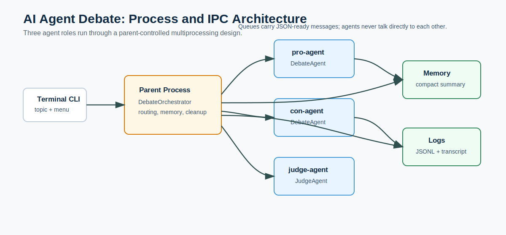
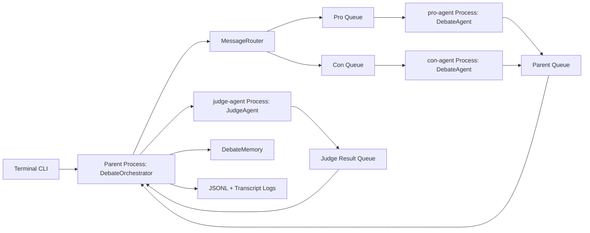
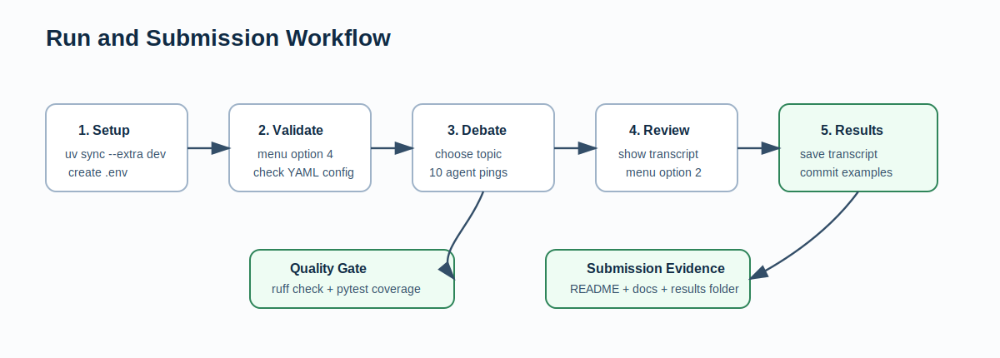

# AI Agent Debate

AI Agent Debate is a Python project for Exercise 02. It implements a structured debate
between three AI-agent roles: a Pro Agent, a Con Agent, and a Judge Agent. The system is
designed around multiprocessing, parent-controlled IPC, JSON-ready messages, prompt
engineering, provider abstraction, transcript logging, and testable terminal operation.

The current project is built for the University of Hertfordshire AI coursework
submission. It follows the assignment expectation that agents should run as separate
processes and communicate through a parent/controller rather than talking directly to
each other.



## Table of Contents

- [Project Goal](#project-goal)
- [What Is Implemented](#what-is-implemented)
- [Architecture](#architecture)
- [Implementation Details](#implementation-details)
- [Provider and Model Choices](#provider-and-model-choices)
- [Runtime Parameters](#runtime-parameters)
- [Setup](#setup)
- [How to Run](#how-to-run)
- [Results and Evidence](#results-and-evidence)
- [Testing and Quality](#testing-and-quality)
- [Self-Score for the Assignment](#self-score-for-the-assignment)
- [Documentation Map](#documentation-map)
- [Limitations](#limitations)

## Project Goal

The default debate topic is:

> Should universities require students to use AI agents in software engineering courses?

Before each run, the CLI asks the user to choose a topic. Pressing Enter uses the default
topic from `configs/debate_config.yaml`. The default configuration runs 5 turns per side,
which creates 10 debate pings before the Judge Agent produces a no-tie decision.

The project also supports custom topics. For example, a topic such as:

```text
What is better sport: pilates or yoga?
```

is converted into a clearer proposition:

```text
Pilates is better than Yoga.
```

The Pro Agent argues for Pilates and the Con Agent argues for Yoga.

## What Is Implemented

- Terminal menu for running debates, showing transcripts, saving transcripts, validating
  config, and exiting.
- Runtime topic selection before every debate.
- Three process-based agents: `pro-agent`, `con-agent`, and `judge-agent`.
- Parent-controlled communication with `multiprocessing.Queue`.
- JSON-ready IPC messages through a validated `Message` schema.
- Prompt/context engineering using the Select/Write pattern.
- LLM provider support for Gemini, Groq, OpenAI, Mistral-compatible APIs, and mock mode.
- Per-role provider selection through `configs/debate_config.yaml`.
- Graceful mock fallback when keys are missing or providers fail.
- Structured JSONL logs and readable transcript files.
- Saved transcript examples in [`results/`](results/).
- Unit and integration tests with coverage enforcement.
- Ruff linting.
- Professional project documentation in [`docs/`](docs/).

## Architecture

The parent process is not a debating agent. It is the supervisor. It starts child
processes, routes messages, records memory, logs transcripts, and cleans up processes.



## Implementation Details

### Process Model

The project uses `multiprocessing.Process` for each agent role:

- `pro-agent`: created in `DebateOrchestrator._start_children()`.
- `con-agent`: created in `DebateOrchestrator._start_children()`.
- `judge-agent`: created in `DebateOrchestrator._decide_with_judge_process()`.

The Judge process starts after all Pro/Con rounds are complete. The parent serializes the
debate messages into dictionaries, sends them to the Judge process, and waits for a final
decision message.

### IPC and Message Format

Agent messages are JSON-ready dictionaries. The central schema is implemented in
`src/agent_debate/ipc/messages.py`.

Example message:

```json
{
  "round": 1,
  "sender": "pro",
  "receiver": "judge",
  "type": "argument",
  "content": "The pro argument text...",
  "sources": [],
  "metadata": {}
}
```

Direct `pro -> con` and `con -> pro` communication is rejected. This keeps the parent
responsible for routing and matches the assignment's process-control idea.

### Turn Order

The orchestrator runs a fixed sequence:

1. Ask Pro for round 1.
2. Ask Con for round 1.
3. Repeat until `turns_per_side` is complete.
4. Start Judge process.
5. Record final decision.
6. Save logs and transcript.

### Context Window Engineering

The project uses the lecture's Select/Write strategy.

Write:

- Full messages are stored in memory during the run.
- Full message dictionaries are written to `logs/debate.jsonl`.
- A readable transcript is written to `logs/transcript.txt`.
- Saved examples are committed under [`results/`](results/).

Select:

- Pro and Con receive only role, stance, topic, rules, current instruction, compact
  summary, opponent previous argument, and web evidence candidates.
- Judge receives topic, rules, latest Pro argument, latest Con argument, compact summary,
  scoring criteria, and required decision format.

The system does not send the entire transcript to every agent on every turn.

### Mock Mode

Mock mode is a local deterministic provider used for tests, missing API keys, and
provider fallback. It is not the same as a real LLM debate.

The current mock provider:

- Produces role-specific and round-specific arguments.
- Uses topic-aware argument banks for the default AI-agents topic and Pilates vs Yoga.
- Produces generic but topic-linked arguments for other topics.
- Scores the latest Pro and Con arguments separately.
- Can choose either Pro or Con as winner.

## Provider and Model Choices

The default provider setup is intentionally mixed across agent roles:

| Role | Provider | Model | Reason |
| --- | --- | --- | --- |
| Judge | Gemini | `gemini-2.5-flash` | Fast, inexpensive judge-style model with strong summarization and evaluation behavior. |
| Pro | Groq | `llama-3.1-8b-instant` | Very fast generation, useful for responsive debate turns and free/low-cost experimentation. |
| Con | OpenAI | `gpt-4.1-mini` | Balanced quality/cost model for coherent rebuttals and structured argumentation. |
| Optional | Mistral | configurable | Supported as an extra OpenAI-compatible provider if the config is changed. |
| Fallback | Mock | `mock` | Local deterministic dry-run behavior for tests and API outages. |

This mixed setup shows that the project is provider-neutral. Each role can use a
different model and API while still communicating through the same internal message
format.

Environment variables:

```env
GEMINI_API_KEY=your_real_google_ai_studio_key
GROQ_API_KEY=your_real_groq_key
OPENAI_API_KEY=your_real_openai_key
MISTRAL_API_KEY=your_real_mistral_key
```

The real `.env` file is ignored by Git. API keys should never be committed.

## Runtime Parameters

Main parameters are configured in [`configs/debate_config.yaml`](configs/debate_config.yaml).

| Parameter | Current Value | Purpose |
| --- | --- | --- |
| `turns_per_side` | `5` | Produces 10 total Pro/Con pings before judging. |
| `llm.timeout_seconds` | `45` | Maximum wait time for a provider response. |
| `llm.max_output_tokens` | `450` | Caps provider output length. |
| `llm.temperature` | `0.4` | Keeps arguments reasonably focused while allowing variation. |
| `llm.mock_when_no_api_key` | `true` | Allows dry runs when keys are missing. |
| `llm.fallback_to_mock_on_provider_error` | `true` | Prevents quota/network failures from crashing the app. |
| `web_search.enabled` | `true` | Allows best-effort DuckDuckGo HTML search. |
| `web_search.max_results` | `3` | Limits evidence candidates passed into prompts. |
| `watchdog.response_timeout_seconds` | `75` | Detects non-responsive agent processes. |
| `gatekeeper.max_calls_per_debate` | `30` | Prevents excessive provider calls. |
| `gatekeeper.max_estimated_input_chars` | `90000` | Prevents very large prompt usage. |

## Setup

From PowerShell:

```powershell
cd C:\Users\Aisha\Desktop\AI\uoh-ay26-ai-agent-debate
uv sync --extra dev
copy .env.example .env
```

Then edit `.env` and add any provider keys you want to use.

For a mock-only dry run, no API keys are required.

## How to Run

Start the CLI:

```powershell
uv run agent-debate
```

Alternative module form:

```powershell
uv run python -m agent_debate.cli
```

Menu:

```text
AI Agent Debate
1. Run debate
2. Show last transcript
3. Save transcript
4. Validate config
5. Exit
```

Recommended manual smoke test:

1. Choose `4` to validate config.
2. Choose `1` to run a debate.
3. Press Enter for the default topic or type a custom topic.
4. Choose `2` to view the latest transcript.
5. Choose `3` to save a timestamped transcript.



## Results and Evidence

The committed [`results/`](results/) folder contains saved transcript examples from
completed runs. These are useful for grading because they show the output format without
requiring the grader to rerun external APIs.

| File | Topic | What It Demonstrates |
| --- | --- | --- |
| [`results/transcript-20260528-004720.txt`](results/transcript-20260528-004720.txt) | Should universities require students to use AI agents in software engineering courses? | Default assignment topic, multi-round Pro/Con debate, provider/model labels, final judge decision. |
| [`results/transcript-20260528-005218.txt`](results/transcript-20260528-005218.txt) | Cristiano Ronaldo vs Lionel Messi | Custom comparison topic and role framing for a non-default debate. |
| [`results/transcript-20260528-005609.txt`](results/transcript-20260528-005609.txt) | AI replacing more jobs than it creates | Custom policy/economics topic with evidence-style arguments and final scoring. |

The runtime `logs/` folder is different from `results/`:

- `logs/transcript.txt` is the latest local run and is reset when a new debate starts.
- `logs/debate.jsonl` is the structured log for the latest local run.
- `results/` contains selected saved examples committed for submission evidence.

## Testing and Quality

Run Ruff:

```powershell
uv run ruff check .
```

Run tests:

```powershell
uv run pytest
```

Current verification result after the latest documentation update:

```text
Ruff: All checks passed
Pytest: 52 passed
Coverage: 88.83%
```

The project requires at least 85 percent coverage through `pyproject.toml`.

## Self-Score for the Assignment

Estimated self-score: **90 / 100**.

| Area | Score | Evidence |
| --- | ---: | --- |
| Multi-agent architecture | 18 / 20 | Pro, Con, and Judge roles exist and now run as separate agent processes. |
| IPC and process control | 18 / 20 | Uses `multiprocessing.Process`, queues, route validation, and watchdog timeouts. |
| Prompt/context engineering | 14 / 15 | Implements Select/Write memory, compact prompts, topic framing, and prompt docs. |
| LLM/provider integration | 13 / 15 | Supports Gemini, Groq, OpenAI, Mistral-compatible APIs, and mock fallback. |
| Logging and results | 10 / 10 | JSONL logs, readable transcript, transcript export, and committed result examples. |
| Testing and quality | 10 / 10 | Ruff passes, 52 tests pass, coverage exceeds 85 percent. |
| Documentation and submission readiness | 7 / 10 | README, PRD, PLAN, PROMPT_BOOK, TODO, requirements, and results are present; final grading still depends on real-provider access and lecturer expectations. |

Remaining risk: real-provider runs depend on valid keys, free quota, billing status, and
network availability. The app handles failures, but real LLM output quality cannot be
guaranteed without working provider access.

## Documentation Map

- [`docs/PRD.md`](docs/PRD.md): product requirements and assignment traceability.
- [`docs/PLAN.md`](docs/PLAN.md): implementation plan, milestones, and verification
  workflow.
- [`docs/PROMPT_BOOK.md`](docs/PROMPT_BOOK.md): prompt templates, topic framing, mock
  behavior, and user-requested design decisions.
- [`docs/TODO.md`](docs/TODO.md): 900-task checklist with completed items checked.
- [`requirements.txt`](requirements.txt): runtime dependencies.
- [`requirements-dev.txt`](requirements-dev.txt): development/test dependencies.
- [`pyproject.toml`](pyproject.toml): package metadata, scripts, Ruff config, and pytest
  coverage gate.

## Repository Layout

```text
uoh-ay26-ai-agent-debate/
├── configs/
│   └── debate_config.yaml
├── docs/
│   ├── PRD.md
│   ├── PLAN.md
│   ├── PROMPT_BOOK.md
│   ├── TODO.md
│   └── assets/
│       ├── architecture-overview.svg
│       └── run-workflow.svg
├── results/
│   ├── transcript-20260528-004720.txt
│   ├── transcript-20260528-005218.txt
│   └── transcript-20260528-005609.txt
├── src/
│   └── agent_debate/
│       ├── agents/
│       │   ├── base.py
│       │   ├── debate_agent.py
│       │   └── judge_agent.py
│       ├── ipc/
│       │   ├── messages.py
│       │   └── queues.py
│       ├── llm/
│       │   ├── base.py
│       │   ├── factory.py
│       │   ├── gemini_client.py
│       │   ├── mock_client.py
│       │   ├── mock_content.py
│       │   ├── mock_scoring.py
│       │   ├── openai_client.py
│       │   └── openai_compatible_client.py
│       ├── logging_utils/
│       │   └── debate_logger.py
│       ├── orchestration/
│       │   ├── debate_orchestrator.py
│       │   └── watchdog.py
│       ├── tools/
│       │   └── web_search.py
│       ├── cli.py
│       ├── config.py
│       ├── config_yaml.py
│       └── memory.py
├── tests/
│   ├── test_agents.py
│   ├── test_cli.py
│   ├── test_config.py
│   ├── test_judge_agent.py
│   ├── test_llm_and_tools.py
│   ├── test_mock_and_tools.py
│   └── ...
├── pyproject.toml
├── requirements.txt
├── requirements-dev.txt
└── README.md
```
